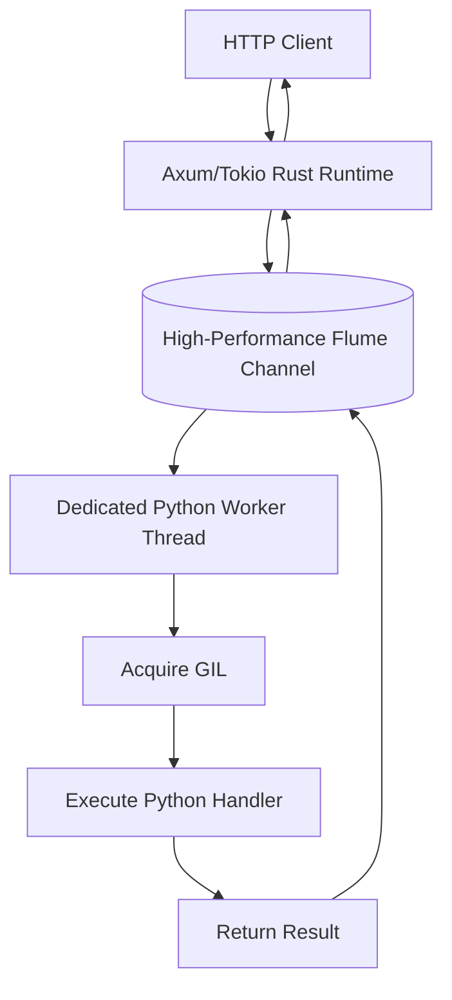

# Architecture Overview

Dapil is designed with a "Rust-First, Python-Friendly" philosophy. It leverages the robust Axum web framework for networking while providing a clean, Pythonic interface for business logic.

## The Core Problem: GIL Contention

In traditional Python/Rust bridges (like those using `spawn_blocking`), multiple threads often compete for the Python Global Interpreter Lock (GIL). This contention creates a bottleneck where threads spend more time waiting for the lock than executing code, severely limiting throughput.

## The Solution: Single Actor GIL Model

Dapil implements a **Single Actor** pattern for GIL management:

### 1. Multi-Threaded I/O (Rust)
Incoming connections and HTTP parsing are handled by **Tokio**, Rust's industry-standard asynchronous runtime. This allows Dapil to handle massive concurrency (thousands of simultaneous connections) without blocking.

### 2. Isolated Python Execution
Instead of calling Python handlers directly from the async task (which would require locking/unlocking the GIL constantly), Dapil sends a message to a **dedicated worker thread**.

### 3. Worker Thread (The Actor)
The worker thread is the only thread that interacts with the Python interpreter. It:
- Waits for a task on a lock-free channel.
- Acquires the GIL once.
- Processes the task.
- Sends the response back.

This "Single Actor" approach ensures that the Python interpreter is always running at peak efficiency, as there is absolutely zero lock contention from other Rust threads.

## Optimized Memory Management

- **String Interning**: Frequently used paths and methods are handled efficiently.
- **Allocation Minimization**: We use direct byte buffers where possible to avoid unnecessary Python-to-Rust string conversions.
- **Link-Time Optimization (LTO)**: When built in release mode, the entire binary (Rust + CPython bridge) is optimized as a single unit by the compiler.
