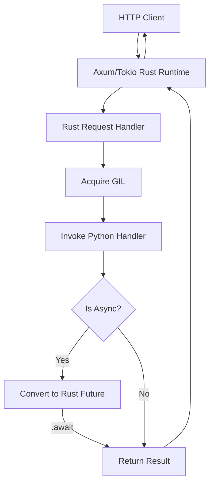

# Architecture Overview

Dapil is designed with a "Rust-First, Python-Friendly" philosophy. It leverages the robust Axum web framework for networking while providing a clean, Pythonic interface for business logic.

## The Core Problem: GIL Contention

In traditional Python/Rust bridges (like those using `spawn_blocking`), multiple threads often compete for the Python Global Interpreter Lock (GIL). This contention creates a bottleneck where threads spend more time waiting for the lock than executing code, severely limiting throughput.

## The Solution: Native Async Coroutine Model

Dapil implements a **Native Async** pattern for GIL management, executing Python coroutines directly on the Rust Tokio runtime:

### 1. Multi-Threaded I/O (Rust)
Incoming connections and HTTP parsing are handled by **Tokio**, Rust's industry-standard asynchronous runtime. This allows Dapil to handle massive concurrency (thousands of simultaneous connections) without blocking.

### 2. Native Coroutine Awaiting
Instead of using a dedicated worker thread (which creates a bottleneck), Dapil converts Python coroutines into **native Rust futures** using `pyo3-async-runtimes`.

### 3. Smart GIL Management
Dapil utilizes `pyo3-async-runtimes::tokio::scope` to manage the GIL efficiently across the async boundary.
- **Acquire Once**: The GIL is acquired only when necessary to call the Python handler.
- **Release during Await**: While a Python coroutine is "awaiting" (e.g., for DB or network), the GIL is released, allowing other threads to execute Python logic.
- **Concurrency**: This allows multiple Python coroutines to be in-flight simultaneously on the same actor-like model but with true async suspension.

This approach ensures that the Python interpreter is always available for work, eliminating the "Single Worker" bottleneck while scaling naturally with Tokio's thread pool.

## Optimized Memory Management

- **String Interning**: Frequently used paths and methods are handled efficiently.
- **Allocation Minimization**: We use direct byte buffers where possible to avoid unnecessary Python-to-Rust string conversions.
- **Link-Time Optimization (LTO)**: When built in release mode, the entire binary (Rust + CPython bridge) is optimized as a single unit by the compiler.
